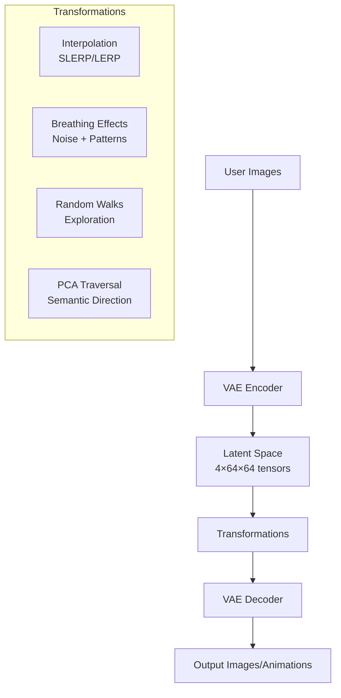
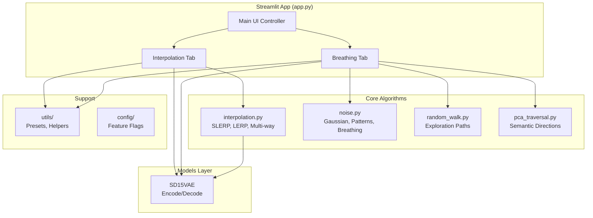

# Diffusion Art Architecture

A latent space exploration toolkit for Stable Diffusion 1.5, focusing on interpolation and transformations between images encoded to latent space.

## System Overview

## Core Data Flow

1. **Input Processing**: 512×512 images uploaded or selected from presets
2. **Encoding**: Stable Diffusion 1.5 VAE compresses to 4-channel 64×64 latent tensors (scale factor 0.18215)
3. **Latent Operations**: Mathematical transformations in compressed space
4. **Decoding**: VAE reconstructs back to 512×512 images
5. **Output**: Individual images or GIF animations

## Application Structure

## Component Details

### Models (`src/diffusion_art/models/`)
- **SD15VAE**: Wrapper around Stable Diffusion 1.5's VAE
- Handles device management (MPS/CPU)
- Caches model loading for performance

### Core Algorithms (`src/diffusion_art/core/`)
- **interpolation.py**: SLERP (spherical) and LERP (linear) interpolation between latent vectors
- **noise.py**: Gaussian noise injection with various breathing patterns (sine, heartbeat, pulse)
- **random_walk.py**: Exploration algorithms (standard, momentum-based, distance-threshold)
- **pca_traversal.py**: Principal component analysis for semantically meaningful transformations

### UI Layer (`src/diffusion_art/ui/`)
- **interpolation_tab.py**: Two-image blending interface
- **breathing_tab.py**: Single-image animation interface
- Each tab handles: image selection, parameter controls, preview generation, final output

### Utilities (`src/diffusion_art/utils/`)
- **presets.py**: Preset image pair management for quick experimentation

## Key Technical Constraints

### Device Management
- **Critical**: All tensor operations must be on same device
- **Common issue**: New tensors default to CPU, must specify `device=existing_tensor.device`
- **Auto-detection**: MPS (Apple Silicon) → CPU fallback

### Latent Space Properties
- **Dimensions**: 4 channels × 64×64 spatial (8× compression from 512×512)
- **Scale factor**: 0.18215 (SD1.5 standard)
- **Interpolation**: SLERP preserves magnitude better than LERP for most cases

### Memory & Performance
- **VAE caching**: Model loaded once with `@st.cache_resource`
- **Session state**: Random walk paths cached to avoid regeneration
- **Streaming**: Animation frames generated progressively with progress bars

## Extension Points

### Adding New Transformations
1. Create algorithm in appropriate `core/` module
2. Add UI controls in relevant tab
3. Ensure proper device management for all tensor operations
4. Follow existing patterns for parameter validation

### Adding New UI Features
1. Create new tab module in `ui/`
2. Register in main `app.py`
3. Follow helper function pattern to manage complexity
4. Use Streamlit's component system for controls

### Preset Management
1. Add image pairs to `assets/` directory
2. Follow naming convention: `category_name_a.jpg`, `category_name_b.jpg`
3. Presets auto-discovered by `presets.py`

## Testing Strategy

Focus on **core mathematical algorithms** rather than UI or model loading:
- Interpolation correctness (SLERP properties, boundary conditions)
- Transformation edge cases (zero vectors, device mismatches)
- Mathematical invariants (magnitude preservation, etc.)

UI and model integration tested through manual validation and CI smoke tests.
